## 本项目完整源码是收费的  接毕业设计和论文

### 作者QQ：3642795578 微信：grapro666 (支持修改、部署调试、支持代做毕设)

### 接网站建设、小程序、H5、APP、各种管理系统、单片机、matlab等

**博客地址：
[https://blog.csdn.net/2303_76227485/article/details/140356944](https://blog.csdn.net/2303_76227485/article/details/140356944)**

**视频演示：
[https://www.bilibili.com/video/BV1PS411w74W/](https://www.bilibili.com/video/BV1PS411w74W/)**

**毕业设计所有选题地址：
[https://github.com/ynwynw/allProject](https://github.com/ynwynw/allProject)**

## 基于Java+Springboot的手机维修管理系统(源代码+数据库)147

## 一、系统介绍
本项目分为用户、管理员、维修员三种角色

### 1、用户：
- 注册、登录、新闻公告、售后申请、申请列表、意见反馈、个人信息、密码修改

### 2、管理员：
- 用户管理、用户管理、栏目管理、网站内容管理、品牌管理、手机类型管理、配件管理、维修订单管理、配件消耗管理、评价管理、意见反馈管理、日志管理、密码修改

### 3、维修员：
- 维系订单管理、配件消耗查询、密码修改

## 二、所用技术

后端技术栈：

- Springboot
- mybatis
- Mysql
- Maven

前端技术栈：
 
- jsp
- bootstrap
- jquery
- ajax

## 三、环境介绍

基础环境 :IDEA/eclipse, JDK1.8, Mysql5.7及以上, Maven3.6, navicat

所有项目以及源代码本人均调试运行无问题 可支持远程调试运行

## 四、页面截图
### 1、用户：

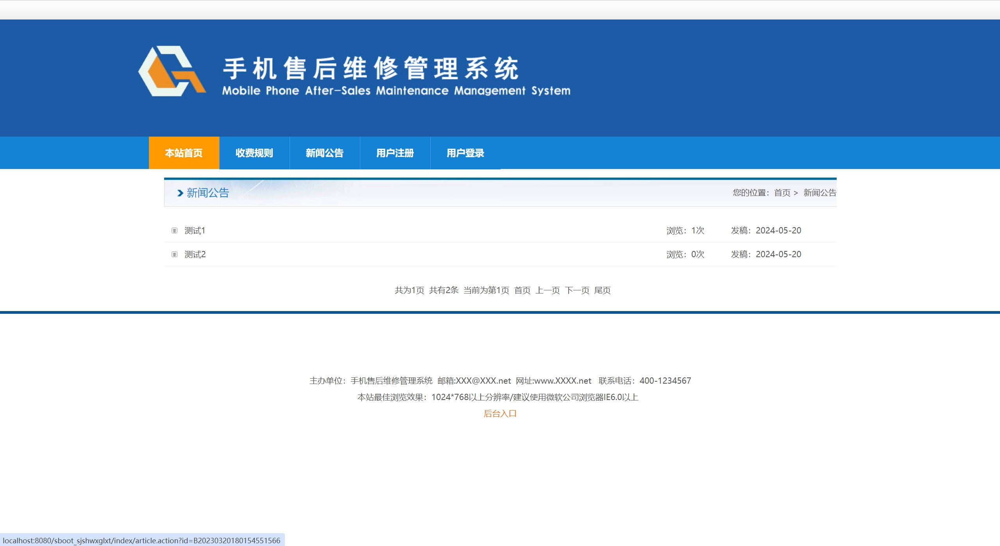

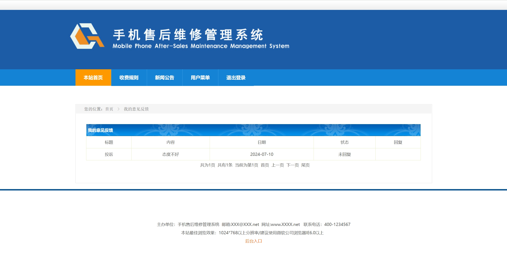
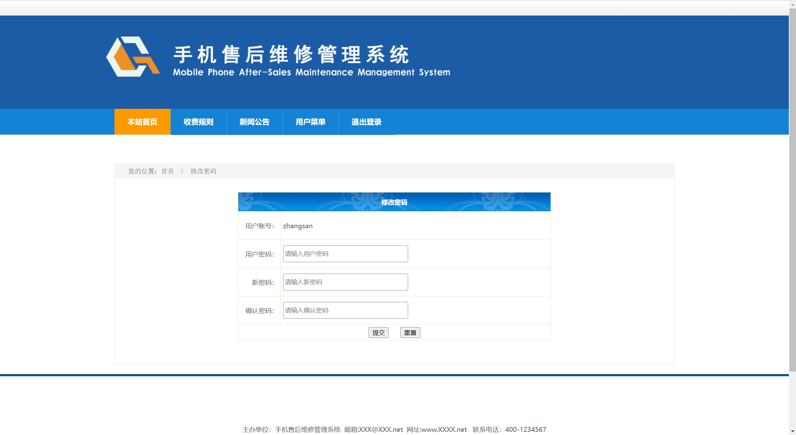

### 2、管理员：

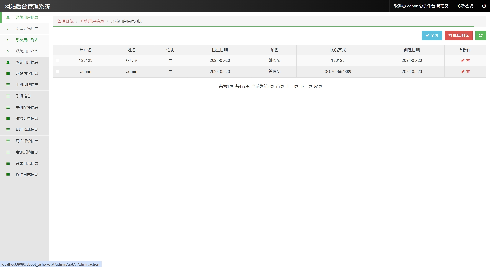
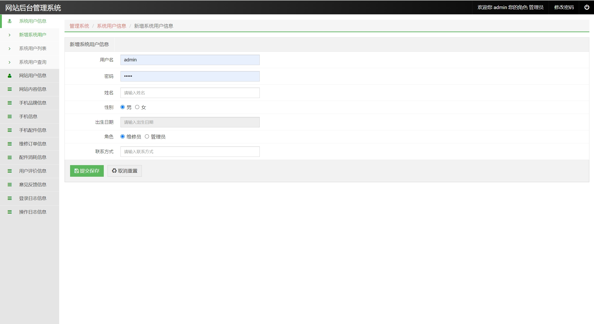

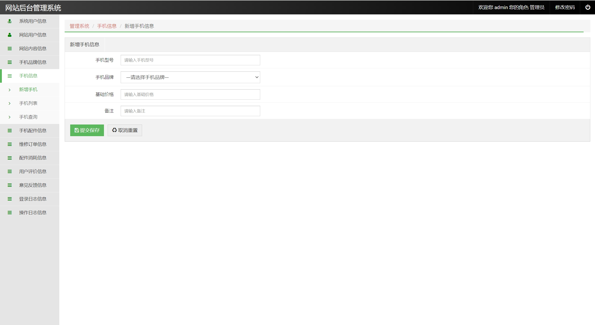
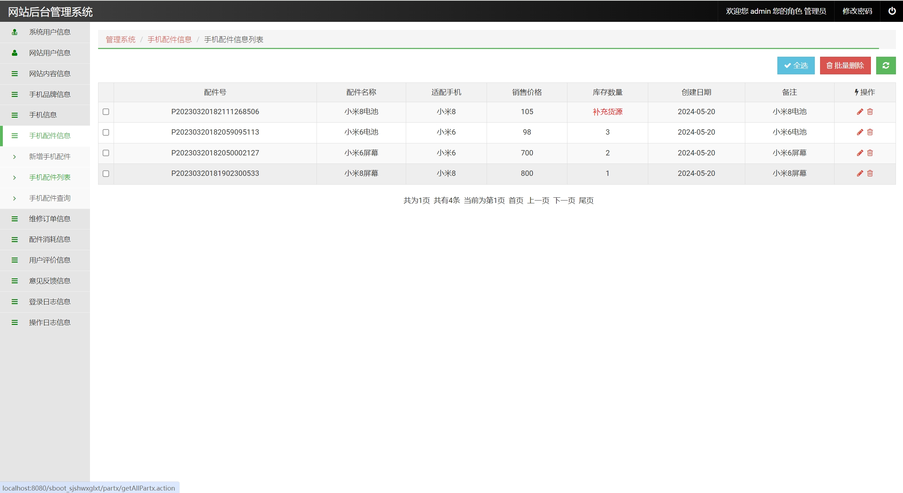
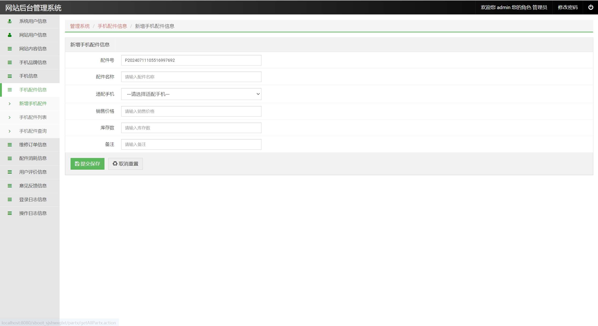
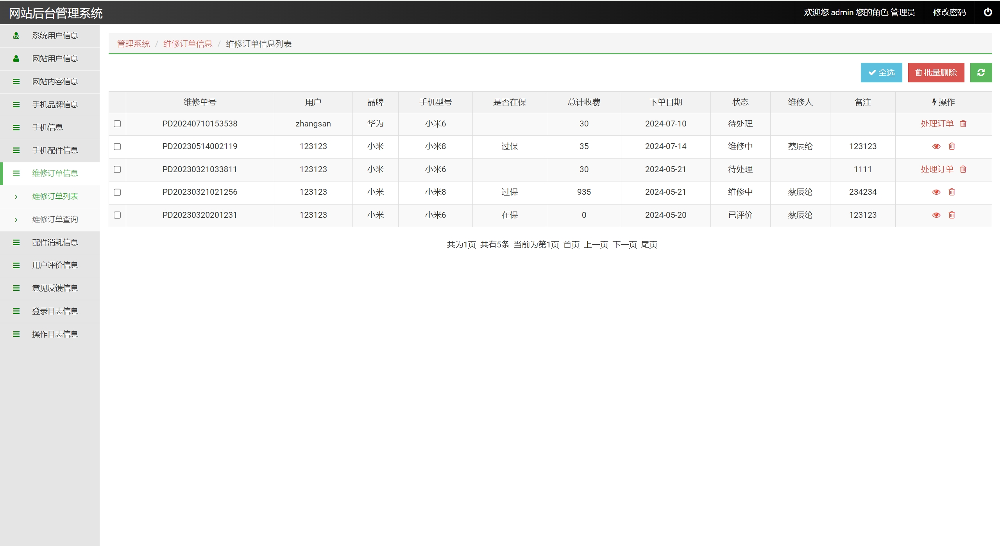

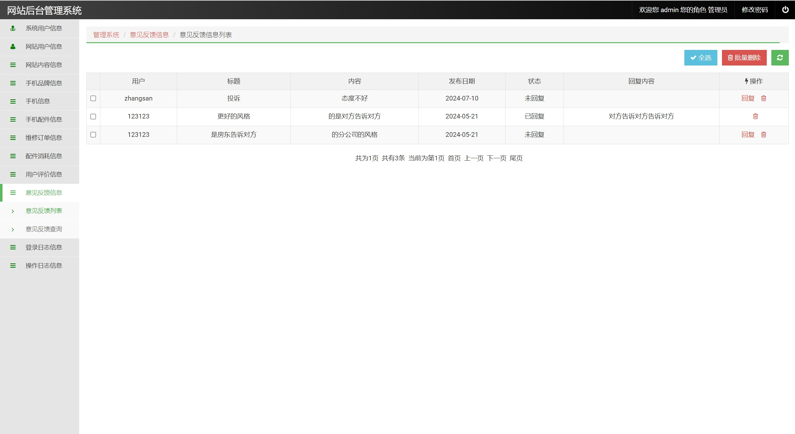

### 3、维修员：

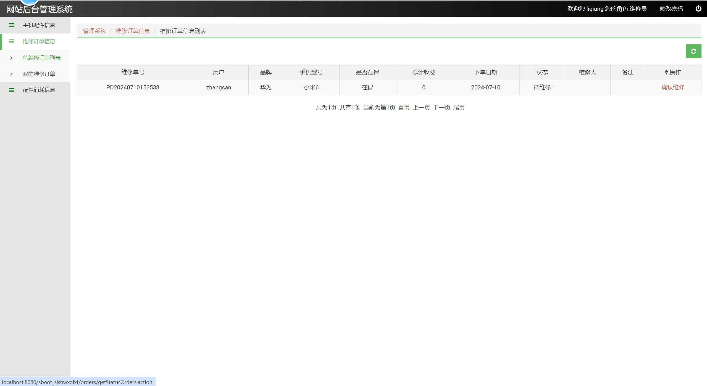

## 五、浏览地址
前台地址：http://localhost:8080/sboot_sjshwxglxt/index/index.action

用户账号密码：zhangsan/123456

后台地址：http://localhost:8080/sboot_sjshwxglxt/admin/index.action

管理员账号密码：admin/admin

维修员账号密码：liqiang/123456

## 六、部署教程
1. 使用Navicat或者其它工具，在mysql中创建对应名称的数据库，并执行项目的sql文件

2. 使用IDEA/Eclipse导入springboot项目，若为maven项目请选择maven，等待依赖下载完成
 
3. 修改application.properties里面的数据库配置,src/main/java/com/SbootSjshwxglxtApplication.java启动后端项目

